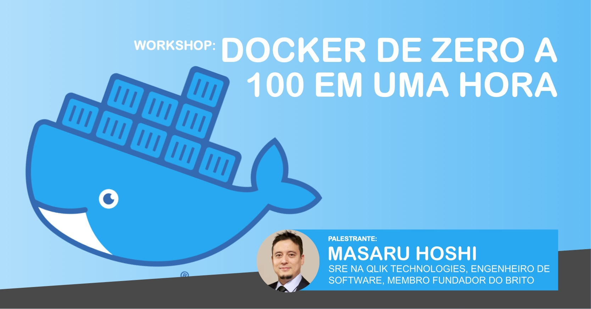
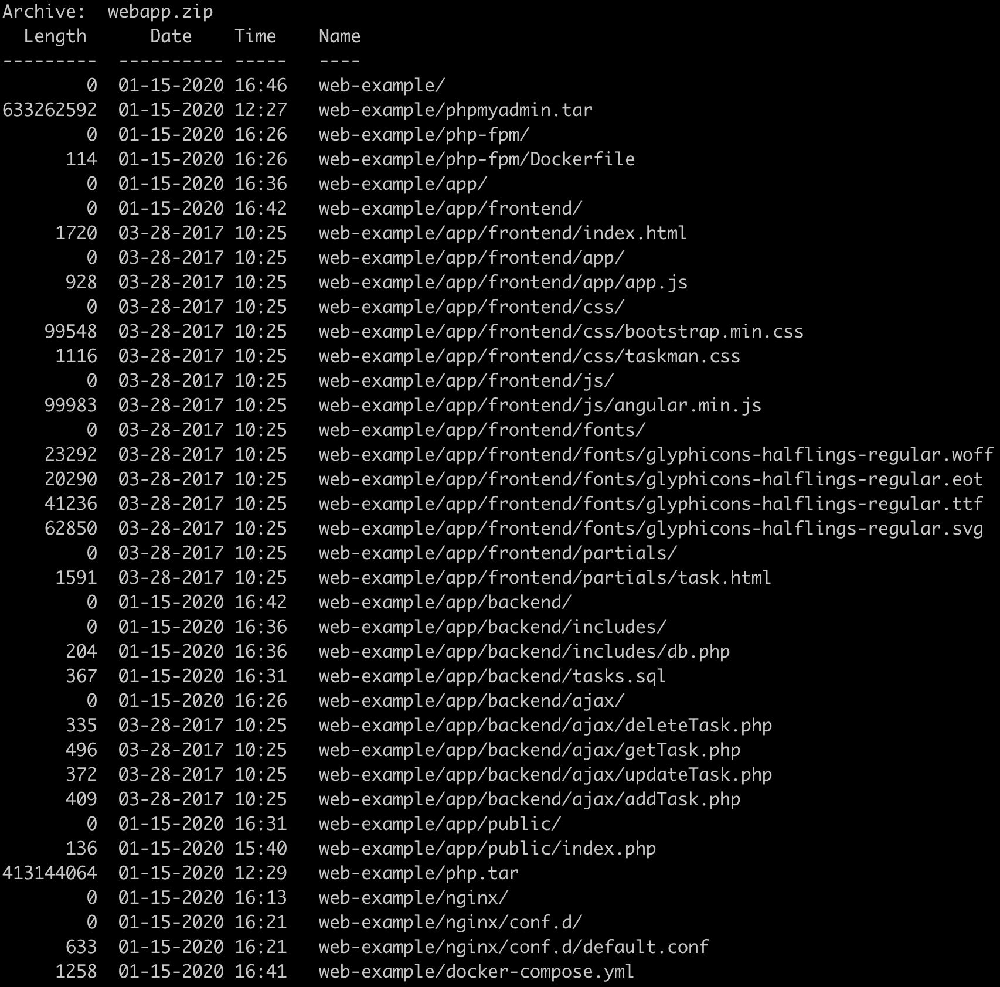
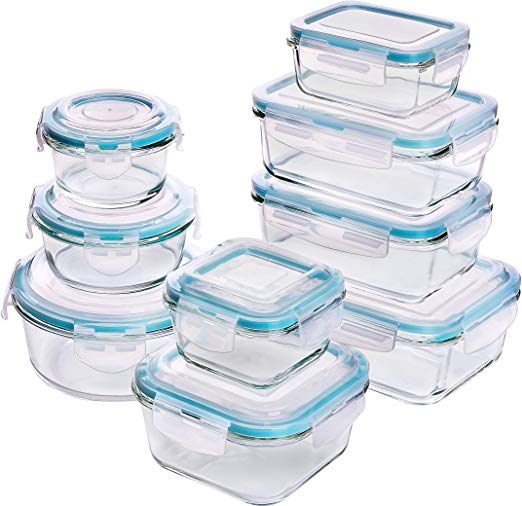

---

# <!--fit-->About Me
* ℹ️ SRE
* 👴 23 years in IT
* 🐧 Hard Linux user
* 🇧🇷 CoFounder of BrITO
* 🥋 Karate instructor
* 🎙️ Podcaster 

---
<!-- class: invert -->

# <!--fit-->Conteiners
How we got to where we are Today

---

# <!--fit-->In the beginning
* 1979: Unix V7
* 2000: FreeBSD Jails
* 2001: Linux VServer
* 2004: Solaris Containers
* 2005: Open VZ (Open Virtuzzo)

---
<!--class: lead -->

# <!--fit-->A new hope
* 2006: Process Containers
* 2008: LXC
* 2011: Warden
* 2013: LMCTFY Let Me Contain That For You
* **2013: DOCKER**

---
<!--class: lead -->

# <!--fit-->What is Docker

---


## Docker is...

* Standard

* Lightweight

* Secure

---

## <!--fit-->Docker is not a VM

* Abstraction
* Full copy of OS
* Slow to boot

---
# <!--fit-->ENOUGH TALK!

---
# First steps
```bash
# Load alpine image
# List your images
docker images

# Let's bring alpine up!
docker run -it alpine:latest
```

---
# <!--fit-->Inspecting and making changes
```bash
# List your containers
docker ps [-a]

# Inspect a container
docker inspect [CONTAINER ID]

# Save a container as an image
docker commit [CONTAINER ID] myfirstimage

# Run your saved container

# Delete an old container
docker rm [CONTAINER ID]
```

---
Persisting stuff
===
```bash
# Mount a volume in a container
docker run -v $PWD:/mystuff -it alpine:latest
```
<!-- _footer: ":information_source: Use `%cd%` instead of `$PWD` if you are in a Windows machine" -->

---


---


# FIRST CHALLENGE
1. Create a container mounting multiples volumes
2. Create multiples containers mounting the same volume
3. Create multiples containers mounting **AND SHARING** multiples volumes

---
First webpage!
===
```bash
# Bring nginx up
docker run -it nginx:1.17.7-alpine

# Change the port
docker run -p 80:80 -it nginx:1.17.7-alpine
```

---
A custom webpage
===
Create a folder named `www` and put a html file in there. Use [this example if you need](http://10.9.9.112:8000/artifacts/nginx-example/www).

```bash
docker run -p 80:80
    -v $PWD/www:/usr/share/nginx/html 
    -it nginx:1.17.7-alpine
```

<!-- _footer: ":information_source: Remember to use `%cd%` instead of `$PWD` if you use Windows" -->

---
Let's play with Databases
===
```bash
docker run -it mariadb:latest
docker run -e MYSQL_ROOT_PASSWORD=root** -it mariadb:latest
docker run --name mariadb -e MYSQL_ROOT_PASSWORD=root -d mariadb:latest
docker exec -it mariadb bash
```

---


<!--fit-->I CHALLENGE YOU
===

---


# Second Challenge
1. Bring up TWO `nginx` containers, running in different ports, but sharing the same set of html files
2. Create a table in `MariaDB`, insert records and make sure it persists after the container is killed

### Make a cute HTML page!

---
<!--fit-->What about a Web application?
===

---

**A full application with:**
* Angular
* nginx
* php-fpm
* MariaDB
* phpMyAdmin

&gt;&gt; [Download this ](http://10.9.9.112:8000/artifacts/web-example/webapp.zip) &lt;&lt;

---
A little taste of what's coming
===
2. `docker-compose -c docker-compose.yml up`

---
What happened?!?!?
===

---
<!--fit-->Welcome to `docker-compose!`
===

With `docker-compose` we are able to composite complex set of containers, specifying networks, volumes, secrets, dependencies and much more!

---

Useful stuff
===
* [Docker Cheat Sheet](https://www.docker.com/sites/default/files/d8/2019-09/docker-cheat-sheet.pdf)
* [Docker Hub](https://hub.docker.com/)
* [Portainer](https://www.portainer.io/)

---

Alternatives
===
* [rkt](https://coreos.com/rkt/docs/latest/)
* [Mesos](http://mesos.apache.org/documentation/latest/mesos-containerizer/)
* [Linux LXC](https://linuxcontainers.org/)
* [Open VZ](https://openvz.org/)
* [containerd](https://containerd.io/)

---


---
<!-- class: lead -->


# <!--fit-->THANK YOU!

:email: hoshi@hoshi.com.br
:link: https://www.linkedin.com/in/masaru.hoshi